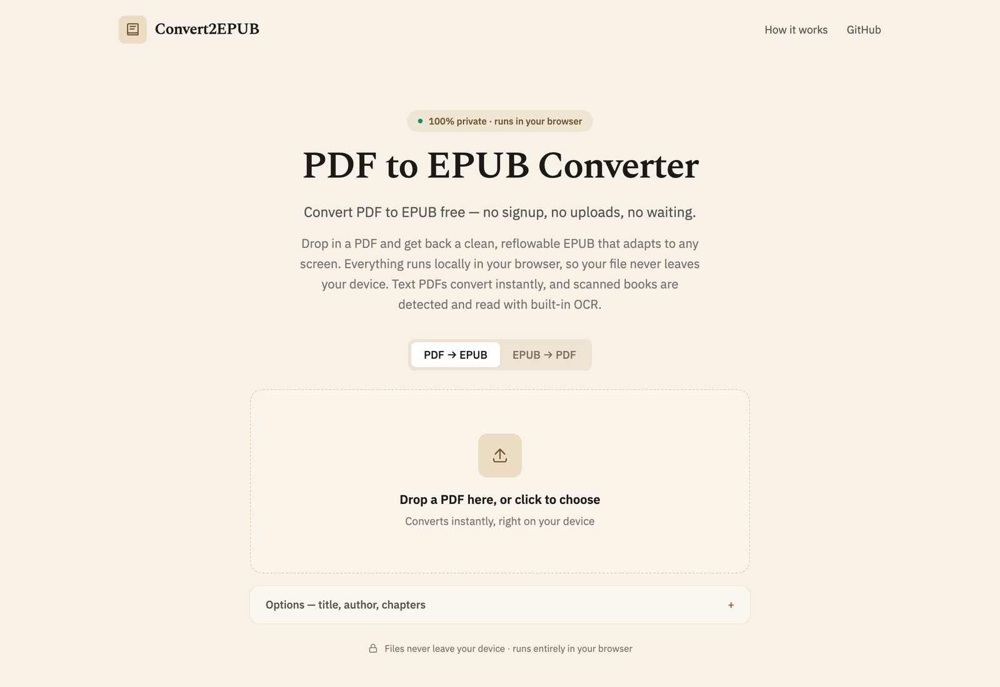

# Convert2EPUB

Free, private ebook converters that run entirely in your browser. Your files
never leave your device — there's no upload, no server, and no account.

**Live:** [convert2epub.online](https://convert2epub.online)



Two working tools today:

- **[PDF → EPUB](https://convert2epub.online/)** — turn a fixed-layout PDF into a
  reflowable EPUB. Extracts text (or runs OCR on scanned PDFs), detects chapters,
  and carries over the cover.
- **[EPUB → PDF](https://convert2epub.online/epub-to-pdf)** — lay an EPUB's
  chapters out into a clean, paginated PDF with real, selectable text and inline
  images.

## How it works

Everything runs client-side. PDF → EPUB uses [PDF.js](https://mozilla.github.io/pdf.js/)
for text/cover extraction, [Tesseract.js](https://tesseract.projectnaptha.com/)
for OCR on scans, and [JSZip](https://stuk.github.io/jszip/) to package a valid
EPUB 3. EPUB → PDF unzips the ebook, walks the OPF spine in reading order, and
renders each chapter with [jsPDF](https://github.com/parallax/jsPDF). The heavy
engines are lazy-loaded only when you actually convert a file.

## Architecture: one template, many pages

The site is built for SEO around a single reusable page template, so each
conversion pair is a real, crawlable tool page rather than a blog post.

- **`src/site/config.ts`** — pure-data `ConversionConfig` for each page (copy,
  steps, features, FAQ, internal links). No React/browser imports, so it's safe
  for the SSR head-builder and sitemap generator too.
- **`src/site/buildHead.ts`** — emits the per-route `<head>`: title, meta
  description, canonical, Open Graph/Twitter, and JSON-LD (`WebApplication`,
  `HowTo`, `FAQPage`, `BreadcrumbList`, `WebSite`). Generated from the same
  config that renders the visible copy, so structured data always matches.
- **`src/components/ConverterPage.tsx`** — the template every page renders from.
- **`src/site/routes.ts`** — maps a path to its config + interactive widget.
- **`src/converters/*`** — the interactive widgets; **`src/lib/*`** — the engines.

Every route is **prerendered to static HTML** (`prerender.js`) with its SEO tags
and body content baked in, then hydrates into the live React app — so crawlers
and social scrapers get real content with no JavaScript required.

### Adding a new converter

1. Add a `ConversionConfig` in `src/site/config.ts` (and to `ALL_CONFIGS`).
2. Build the engine in `src/lib/` and a widget in `src/converters/`.
3. Register the path → config + widget in `src/site/routes.ts`.

The new page automatically gets prerendered, added to the sitemap, and linked.

## Local development

```bash
npm install
npm run dev
```

## Production build

```bash
npm run build
```

This typechecks, builds the client, builds the SSR entry, then prerenders every
route plus `sitemap.xml` into `dist/` (a static site). The canonical domain lives
in `SITE_URL` in `src/site/config.ts`.

## Limitations

- **PDF → EPUB:** text-based PDFs convert instantly; scanned PDFs go through OCR
  (English only, slower). Inline figures, footnotes, and complex multi-column
  layouts may not reflow perfectly.
- **EPUB → PDF:** optimized for Latin-script text; typographic punctuation is
  normalized to ASCII to suit jsPDF's built-in fonts. Heavy CSS and multi-column
  layouts are simplified into a clean, readable flow.
